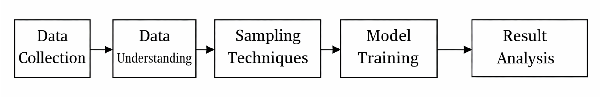
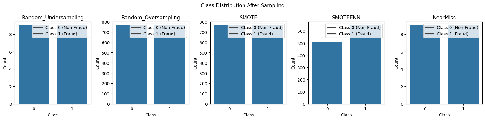
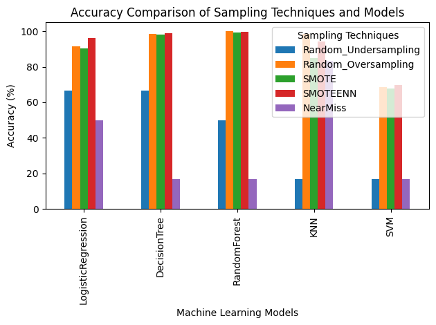

# Sampling_Credit_Card

## 1. Methodology

The following methodology was used in this assignment:

## Explanation:

- The dataset was collected from the provided GitHub repository.
- Class imbalance in the dataset was identified and analyzed.
- Different sampling techniques were applied to balance the dataset.
- Multiple machine learning models were trained on the sampled data.
- Model performance was evaluated and compared using accuracy.

---

## 2. Description

- Dataset Used: Credit Card Fraud Detection Dataset
- Target Variable: Class
    Class 0 → Non-Fraud
    Class 1 → Fraud
- Nature of Dataset: Highly imbalanced

Class Imbalance in Dataset

## Sampling Techniques Used

- Random Undersampling
- Random Oversampling
- SMOTE
- SMOTEENN
- NearMiss

## Machine Learning Models Used

- Logistic Regression
- Decision Tree
- Random Forest
- K-Nearest Neighbors (KNN)
- Support Vector Machine (SVM)

Evaluation Metric: Accuracy

---

## 3. Balanced Dataset After Sampling

After applying sampling techniques, the dataset becomes balanced with nearly equal representation of fraudulent and non-fraudulent transactions. This balancing helps machine learning models learn patterns from both classes more effectively.

---

## 4. Input / Output

## Input

- Numerical transaction features
- Imbalanced class labels (fraud and non-fraud)

## Output

- Balanced datasets after sampling
- Accuracy scores for each model and sampling technique
- Comparative result table and graphs

---

## 5. Result Table
The table below shows the accuracy (%) of different machine learning models under various sampling techniques.

| Model               | Random_Undersampling | Random_Oversampling | SMOTE | SMOTEENN | NearMiss |
| ------------------- | -------------------- | ------------------- | ----- | -------- | -------- |
| Logistic Regression | 66.67                | 91.70               | 90.39 | 96.24    | 50.00    |
| Decision Tree       | 66.67                | 98.69               | 98.03 | 98.27    | 16.67    |
| Random Forest       | 16.67                | 100.00              | 99.34 | 99.71    | 16.67    |
| KNN                 | 16.67                | 98.47               | 84.72 | 94.22    | 83.33    |
| SVM                 | 16.67                | 68.56               | 67.69 | 69.65    | 16.67    |

---

## 6. Result Graph

---

## 7. Observations

- Model performance varies with different sampling techniques.
- Oversampling and hybrid methods generally improve accuracy on imbalanced data.
- Undersampling can reduce performance due to loss of important information.
- Choosing an appropriate sampling technique is crucial for reliable results.

---

## 8. Conclusion

This assignment demonstrates the importance of sampling in handling imbalanced datasets. Different sampling techniques influence machine learning models in different ways, and no single technique works best for all models. Proper selection of sampling strategies improves predictive performance.
